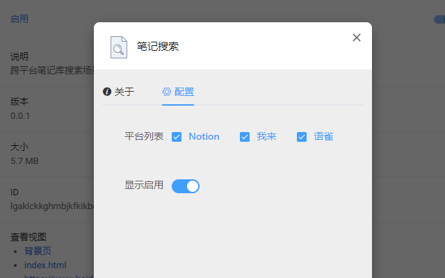

# 笔记搜索扩展

跨平台笔记库搜索场景植入
对多个平台的笔记库内容进行搜索场景植入，提高笔记库信息的利用率。现已支持Notion，语雀，我来等平台  

## 支持平台
- [x] Notion
- [x] 语雀
- [x] 我来
- [x] diigo
- [ ] flomo
- [ ] 印象笔记
- [ ] 石墨文档

## 安装方式

#### Chrome 商店

[传送门](https://chrome.google.com/webstore/detail/%E7%AC%94%E8%AE%B0%E6%90%9C%E7%B4%A2/ddbdehldpmpcjaofoglgkcjdkmogdnei)

#### 开发者模式安装

1. [下载](https://github.com/lljxx1/Note-Search/releases) 并解压
2. 打开 chrome://extensions
3. 右上角“开启开发者模式”
4. 拖入解压后的文件夹到浏览器插件页
